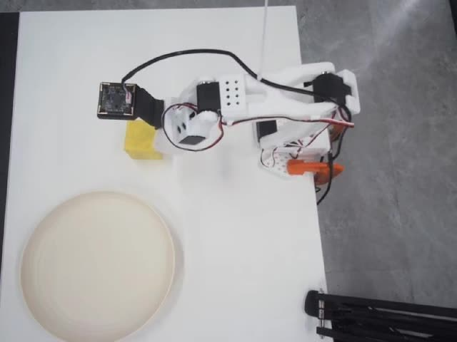
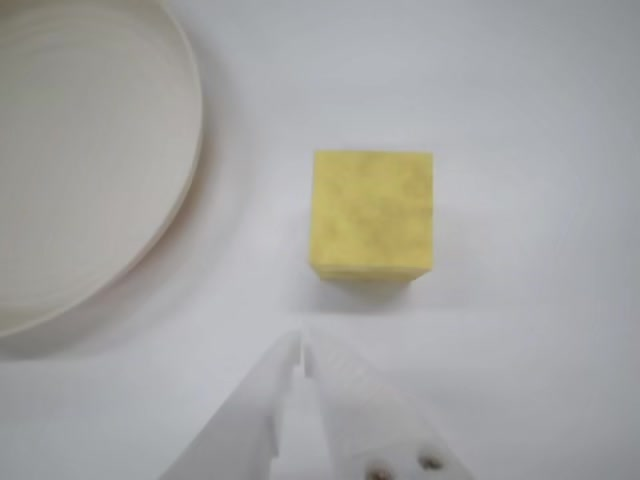
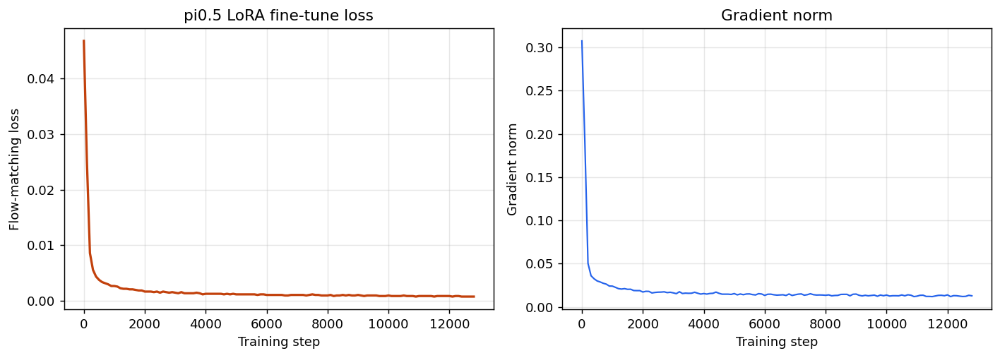

https://github.com/user-attachments/assets/67a7d02a-0912-41c1-8959-e1c6d37c49cf
# Fine-tuning π₀.₅ for Real-World Robot Manipulation on SO-101


    

End-to-end pipeline for adapting **π₀.₅** (Physical Intelligence's vision-language-action
model) to a **real SO-101 manipulator**: designing manipulation tasks, collecting
teleoperated demonstrations, packaging them as LeRobot datasets, LoRA fine-tuning the
full VLA on a single GPU, and deploying the policy back on the real arm.

> Done during a research internship. <!-- 在这里补公司名（如允许）：at xcdl -->

## Demo

| Global view (data collection) | Wrist view |
|---|---|
|  |  |

▶ Raw demonstration clips: [`assets/sample_global.mp4`](assets/sample_global.mp4) ·
[`assets/sample_wrist.mp4`](assets/sample_wrist.mp4) ·
[`assets/sample_breakfast_front.mp4`](assets/sample_breakfast_front.mp4)

### Fine-tuned π₀.₅ on real SO-101


Uploading 72efda1252317e9823fe814fb97e274f.mp4…


[▶ 观看真机部署视频](assets/demo_pi05_so101.mp4)

## Downloads

| Resource | Link | Size |
|---|---|---|
| Dataset: breakfast (49 eps) | [jt-2026/so101-breakfast](https://huggingface.co/datasets/jt-2026/so101-breakfast) | 790 MB |
| Dataset: yellow-block-plate (25 eps) | [jt-2026/so101-yellow-block-plate](https://huggingface.co/datasets/jt-2026/so101-yellow-block-plate) | 335 MB |
| Trained checkpoint (15k steps) | [jt-2026/pi05-so101-lora-v1](https://huggingface.co/jt-2026/pi05-so101-lora-v1) | 9.5 GB |

```bash
# Download dataset
huggingface-cli download jt-2026/so101-breakfast --repo-type dataset --local-dir ~/.cache/huggingface/lerobot/jt-2026/so101-breakfast

# Download checkpoint
huggingface-cli download jt-2026/pi05-so101-lora-v1 --local-dir checkpoints/pi05_so101_lora_finetune/so101_lora_v1/15000
```

## Pipeline

```
 task design ──► teleoperation ──► LeRobot v2.1 ──► π₀.₅ LoRA fine-tune ──► real-arm rollout
 (2 tasks)       (JoyCon, 30 fps)    (25 + 14 eps)     (dual-expert LoRA)     (SO-101)
```

### 1 · Task design

Two manipulation tasks of increasing difficulty, designed from scratch:

| Task | Instruction (prompt) | Episodes | Cameras |
|---|---|---|---|
| **yellow-block-plate** | *"Pick up the yellow block and place it into the plate"* | 25 | global + wrist |
| **breakfast table-setting** | *"First put the block onto the plate, move the plate to the center of the table, place the spoon on the right side of the plate, and place the cup on the left side of the plate."* | 14 | front + side |

The breakfast task is **multi-step and long-horizon** — four sequential object
rearrangements in one language-conditioned rollout — which is exactly the regime
where VLA pretraining should pay off.

### 2 · Data collection

- **Hardware:** SO-101 leader–follower arm pair, **JoyCon-based teleoperation**
- **Recording:** `lerobot-record`, 30 fps, joint-space actions (6-DoF: shoulder_pan /
  shoulder_lift / elbow_flex / wrist_flex / wrist_roll / gripper)
- **Observations:** one global scene camera (640×480) + one wrist camera, stored as
  mp4 video streams alongside parquet state/action tracks (LeRobot v2.1)

### 3 · Fine-tuning π₀.₅

Rather than training a policy from scratch, I adapted the pretrained **π₀.₅** VLA
(PaliGemma 3B VLM + 300M action expert, flow-matching action decoder) with **LoRA
adapters on both experts**, starting from the public `pi05_base` checkpoint:

- framework: [openpi](https://github.com/Physical-Intelligence/openpi) (JAX)
- config: [`config/pi05_so101_lora_finetune.py`](config/pi05_so101_lora_finetune.py)
- 30k steps planned, checkpoints every 5k; trained on a single NVIDIA L20
- full config in [`config/`](config/), launch script in [`scripts/train.sh`](scripts/train.sh)

### 4 · Results

Training converges smoothly — flow-matching loss drops from **4.7e-2 to 8e-4**
within ~13k steps and stays flat:



The fine-tuned policy was deployed back on the physical SO-101 arm and executes the
task in the real world. <!-- rollout video 见上方 TODO -->

## Dataset card

Both datasets follow the [LeRobot v2.1](https://github.com/huggingface/lerobot) schema
(see [`docs/dataset.md`](docs/dataset.md) for the full feature spec):

| Field | Value |
|---|---|
| Format | LeRobot v2.1 (parquet + mp4 video streams) |
| FPS | 30 |
| Action | `float32[6]` — joint positions |
| State | `float32[6]` — joint positions |
| Cameras | `observation.images.global` 640×480 · `observation.images.wrist` |
| Size | 335 MB (yellow-block-plate, 25 episodes) |

## Repo structure

This repo contains the **full modified openpi source** with SO-101 customizations already integrated:

```
├── src/openpi/              # openpi Python package (modified)
│   ├── training/config.py   # LeRobotSO101DataConfig + pi05_so101_lora_finetune config
│   ├── policies/so101_policy.py  # SO-101 input/output transforms
│   └── ...
├── examples/                # openpi examples (aloha, droid, libero, etc.)
├── scripts/                 # training, inference, data processing scripts
├── packages/                # openpi sub-packages
├── assets/                  # sample videos, frames, loss curve
├── config/                  # SO-101 config reference
├── docs/                    # dataset spec, architecture docs
├── pyproject.toml           # project dependencies (uv/pip)
└── README.md
```

## Environment setup

### Prerequisites

| Requirement | Version | Notes |
|---|---|---|
| Python | ≥ 3.11 | Required by openpi |
| CUDA | 12.x | JAX builds against CUDA 12 |
| GPU | NVIDIA (L20 / A100 / 4090) | Single GPU sufficient for LoRA fine-tune |
| OS | Linux (Ubuntu 22.04+) | Primary supported platform; WSL2 works too |

### Option A: uv (recommended, faster)

```bash
# Install uv if not present
curl -LsSf https://astral.sh/uv/install.sh | sh

git clone https://github.com/ljt228/pi05-so101-finetune.git
cd pi05-so101-finetune
git checkout pi05-so101-finetune-0825

uv sync                              # creates .venv, installs all deps
uv run scripts/train.py pi05_so101_lora_finetune --exp so101_lora_v1
```

### Option B: pip

```bash
git clone https://github.com/ljt228/pi05-so101-finetune.git
cd pi05-so101-finetune
git checkout pi05-so101-finetune-0825

python -m venv .venv && source .venv/bin/activate
pip install -e ".[dev]"
```

### Key dependencies (installed automatically)

| Package | Version | Purpose |
|---|---|---|
| `jax[cuda12]` | 0.5.3 | Core ML framework |
| `flax` | 0.10.2 | Neural network library for JAX |
| `torch` | 2.7.1 | PyTorch (data loading, some ops) |
| `lerobot` | commit `0cf8648` | LeRobot v2.1 dataset format |
| `transformers` | 4.53.2 | HuggingFace model support |
| `orbax-checkpoint` | 0.11.13 | Checkpoint save/load |
| `wandb` | ≥ 0.19.1 | Experiment tracking |

### SO-101 specific packages (if using real robot)

For data collection and real-robot deployment, install these separately:

```bash
pip install so-101 gym-so101 robodiff
pip install rerun-sdk rerun-imjoy-plugin   # visualization
```

### Dataset setup

Place your LeRobot v2.1 dataset under:

```
~/.cache/huggingface/lerobot/<repo_id>/
├── data/
│   └── chunk-000/
│       └── episode_000000.parquet
├── videos/
│   └── chunk-000/
│       └── observation.images.global_episode_000000.mp4
├── meta/
│   ├── info.json
│   └── stats.json
└── task_index.json
```

Or compute norm stats first:

```bash
uv run scripts/compute_norm_stats.py <repo_id>
```

### Training

```bash
# LoRA fine-tune on SO-101
uv run scripts/train.py pi05_so101_lora_finetune --exp so101_lora_v1

# Checkpoints saved to: checkpoints/<exp_name>/<step>/params/
# Logs saved to: wandb/ (if enabled)
```

### Inference

```bash
# Serve a trained policy
uv run scripts/serve_policy.py --config pi05_so101_lora_finetune --checkpoint checkpoints/pi05_so101_lora_finetune/<step>
```

Raw training log (129 loss/grad-norm records): [`assets/train.log`](assets/train.log).

## Troubleshooting

| Issue | Solution |
|---|---|
| `jaxlib` CUDA mismatch | Ensure `nvidia-cuda-runtime-cu12`, `nvidia-cudnn-cu12` are installed; run `python -c "import jax; print(jax.devices())"` to verify GPU detection |
| `lerobot` import error | Lerobot is pinned to commit `0cf8648` — do not upgrade independently |
| `norm_stats.json` not found | Run `uv run scripts/compute_norm_stats.py <repo_id>` before training |
| Checkpoint not loading | Ensure `gs://openpi-assets/checkpoints/pi05_base/params` is accessible (or download manually to `checkpoints/`) |
| OOM on single GPU | Reduce `batch_size` in config (default 32); L20 handles ~16, A100 handles 32+ |
| `wandb` login required | `wandb login` or set `WANDB_DISABLED=true` to disable logging |

## What's modified from upstream openpi

1. **`src/openpi/training/config.py`** — added `LeRobotSO101DataConfig` class and `pi05_so101_lora_finetune` TrainConfig
2. **`src/openpi/policies/so101_policy.py`** — new SO-101 input/output transform (dual cameras, 6-DoF actions)

All other files are stock openpi (Physical Intelligence).

## Acknowledgements

- [openpi](https://github.com/Physical-Intelligence/openpi) & π₀.₅ —
  Physical Intelligence ([paper](https://arxiv.org/abs/2504.16054))
- [LeRobot](https://github.com/huggingface/lerobot) & the [SO-101](https://github.com/TheRobotStudio/SO-ARM100) arm — Hugging Face + TheRobotStudio

---

*Built by [ljt228](https://github.com/ljt228) — M.S. student in mechanical
engineering, working on VLA / world-action models.*
